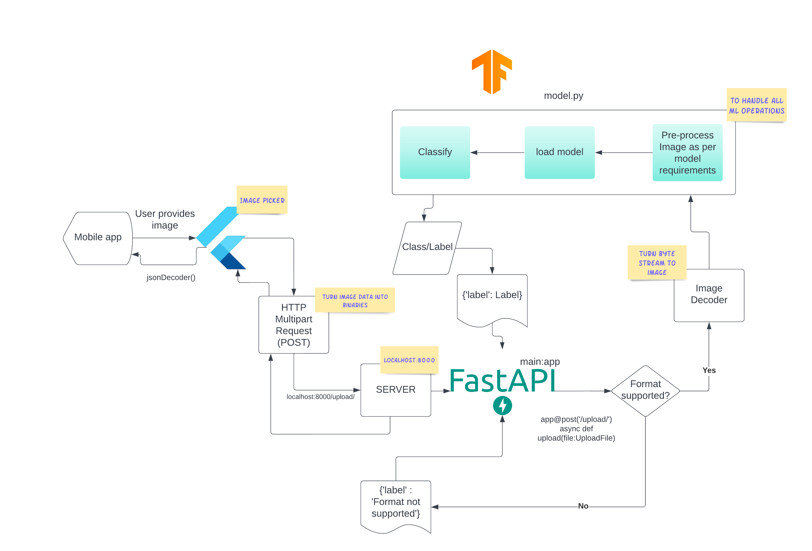

# Fish-freshness-recognition-application
 Firsh freshness detection application using yolo V2 and Flutter

## Prerequisites:
 * Flutter 
 * FastAPI
 * Tensorflow

## Project Structure:
 This project has two directories:
 1. *Application:* Here all the files for flutter native application are stored. In order to run the application type 
 ```powershell
 flutter run
 ```
 in terminal while being in the aqua-vision directory and with appropriate simulator/emulator/USB-debugging configured 
 
 2. *API:* Here all the files for API are stored. In order to run the API first install al the packages in [requiremets.txt](https://github.com/ommahale/Fish-freshness-recognition-application/blob/main/API/requirements.txt). Now in the API directory type `uvicorn main:app --reload` in terminal. Now the API is up and running. In order to access it simply open the [localhost:8000](http://localhost:8000) in your browser. In order to access API through Swagger UI open [localhost:8000/docs](http://localhost:8000/docs)

## How to run the project:
In order to run the project first make sure that you have enabled chrome port forwarding in your browser. This will help our local device connected via USB to access the PC localhost where our API will be running. If not enabled follow the following steps:
* Go to [chrome inspect panel](chrome://inspect) and click on poert forwarding.
* In the enabled sockets section enter port no 8000 and 127.0.0.1:8000 in IP:port section and check the enable port forwarding field.
* Wait for the prot to connect to the device
Now that our device can access the localhost we can proceed to run the application.
<br><br/>
Type `flutter run` in terminal or press f5 key to run the application in debug mode. The output of the data recieved form the api after the image has beeen selected will be displayed on the debug console.

## Dependencies used:
  
For flutter  
  ```yaml
  http: ^0.13.5
  image_picker: ^0.8.6
  dio: ^4.0.6
  ```


For python

```powershell
anyio==3.6.2
click==8.1.3
colorama==0.4.6
fastapi==0.88.0
h11==0.14.0
idna==3.4
multipart==0.2.4
pydantic==1.10.2
sniffio==1.3.0
starlette==0.22.0
typing_extensions==4.4.0
uvicorn==0.20.0
anyio==3.6.2
click==8.1.3
colorama==0.4.6
fastapi==0.88.0
h11==0.14.0
idna==3.4
multipart==0.2.4
pydantic==1.10.2
sniffio==1.3.0
starlette==0.22.0
typing_extensions==4.4.0
uvicorn==0.20.0
```

